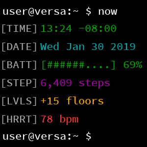
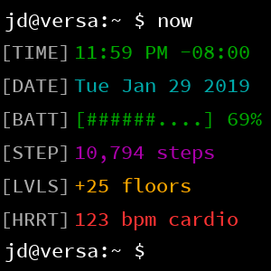
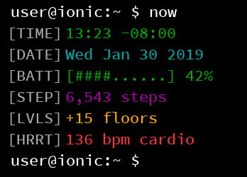
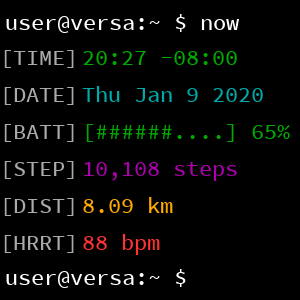
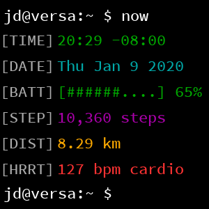

# Terminal for Fitbit
Inspired by [quarlow's amazing terminal watchface for Galaxy Gear](https://www.reddit.com/r/unixporn/comments/9ndo8o/oc_always_keep_some_terminal_with_you/), Terminal is a clock face styled to match a terminal session in a Unix environment.

## Screenshots
### Versa, Versa 2

### Ionic

### Versa Lite
_Versa Lite shows distance instead of elevation gain._

## Changelog
### Terminal v2.0.2 - 2020-09-21
- Fix: Prevent clipping of usernames longer than 4 char (bug #14)
- Misc: Add warning in settings if username is longer than 8 char

### Terminal v2.0.1 – 2020-07-03
- Fix: Better support for the wider Ionic screen
- Fix: Add `access_internet` permission to fix loading of Theme previews
    - This permission will be used more in an upcoming version of Terminal
- Misc: Better instructions on removing/adding data when your watch has 6 rows

### Terminal v2.0.0 – 2020-03-22
- A complete and total rewrite of Terminal, loaded with new features and customizability!
- Add support for rearranging and changing up to 6 lines of content
    - `TIME`, `DATE`, `BATT`, `STEP`, `DIST`, `LVLS` (on supported devices), and `HRRT`.
- Add support for customizing fonts:
    - Source Code Pro (original font from v1), Hack, Fira Code, Sudo, Roboto Mono, and Nova Mono.
- Add support for themes:
    - Default (original theme from v1), Dracula, Hopscotch, Solarized Dark, and Solarized Light.
- Update @fitbit/sdk to ^4.1.0

### Terminal v1.1.0 – 2020-01-09
- Add official support for Versa 2 (mira)
- Add support for Versa Lite (gemini)
    - Show distance (`[DIST]`) in km or mi instead of floors (`[LVLS]`)
    - The `[DIST]` option will appear for other devices in a future update
- Bugfix: Sometimes settings would become unrecoverably damaged, preventing username changes.
- Update @fitbit/sdk to ^4.0.2
- Update @fitbit/sdk-cli to ^1.7.1
- Update fitfont to ^1.3.1
    - Rebuild font files
- Internal: start work to supporting dynamic row content

### Terminal v1.0.3 – 2019-10-07
- Bugfix: Versa 2 hostname displays as "@versa 2" instead of "@versa"
- Update @fitbit/sdk to ^3.1.2
- Update @fitbit/sdk-cli to ^1.6.3

### Terminal v1.0.2 – 2019-01-31
- Bugfix: Fix "12pm" displaying as "12am"

### Terminal v1.0.1 – 2019-01-30
- Bugfix: Fix username painting
- Bugfix: Remove debug code preventing stale heartrates from displaying as '--'

## Credits
- Inspired by quarlow's [amazing terminal watchface](https://www.reddit.com/r/unixporn/comments/9ndo8o/oc_always_keep_some_terminal_with_you/) for Galaxy Gear/Wear OS, nsmith543's [terminal watchface](https://github.com/nsmith543/terminal) clone for Garmin watches, and Dr_Schmoctor's [terminal watchface](https://amazfitwatchfaces.com/bip/view/?id=15384) clone for Amazfit Bip.
- [FitFont for Fitbit](https://github.com/gregoiresage/fitfont) (seriously, thank you so much Grégoire)
- [Source Code Pro Medium](https://github.com/adobe-fonts/source-code-pro)
- Fitbit's open source [Moment clock face](http://github.com/fitbit/sdk-moment)
